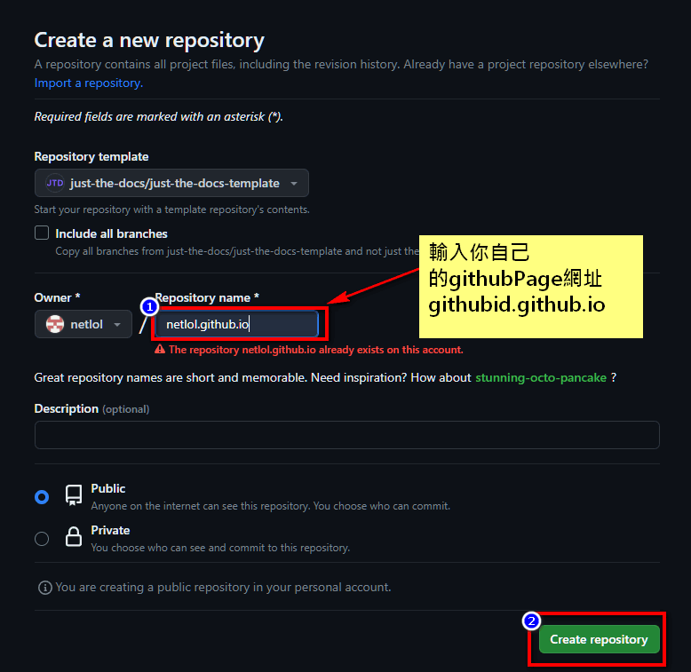

<!-- COMMENTS
-->

# 第 3-1 篇



[jekyll-theme-chirpy](https://github.com/cotes2020/jekyll-theme-chirpy)

[just-the-docs](https://just-the-docs.github.io/just-the-docs/)

點選 下方 "use this templete"

[use this templete](https://github.com/new?template_name=just-the-docs-template\&template_owner=just-the-docs)


設定完成後，會建立一個   `你的github id.guthub.io`    的 repo

然後到   `你的github id.guthub.io`    repo 點選 `setting`

點選右手邊的 `Pages`，在 `Source` 的下拉選單選擇 `Github Actions`


你的 GithubPage 就已經套用 **just-the-docs** 這個 Theme 了

再編輯`_config.yml`，在 `url:` 輸入你的 GitPages url ，然後 commit & push.


瀏覽你的 GithubPage

[你的 github id.guthub.io](https://netlol.github.io/)

在前述 repo 的根目錄下依 [index.md](https://github.com/just-the-docs/just-the-docs/blob/main/index.md?plain=1) 格式新增 md 檔即可增加文件。

主要是加入以下 metadata

```yml
---

layout: default

title: 文章標題

nav_order: 3

description: "文章描述"

---

```
